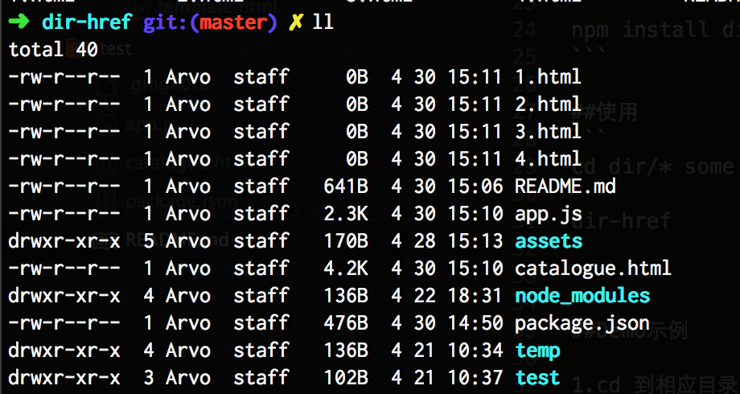
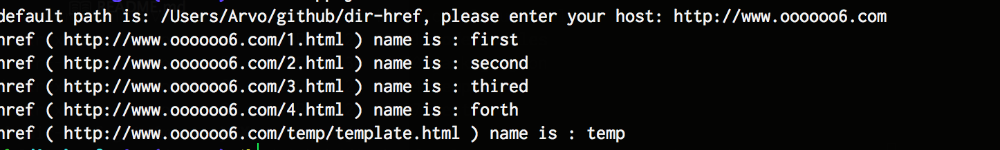
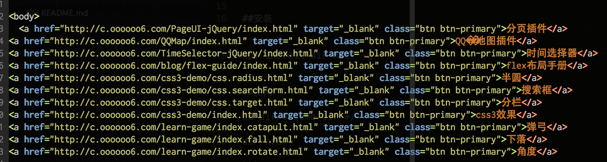

dir-href

##说明

能够找到当前目录下所有的.html文件，并且提示你命名同时生成html目录

```
  assumption：
    your host is : http://www.oooooo6.com
    your file's dir in your server:
                   /Users/Arvo/github/dir-href/1.html
                   /Users/Arvo/github/dir-href/abc/2.html
                   /Users/Arvo/github/dir-href/abc/def/3.html
                   ...


  => //cd /Users/Arvo/github/dir-href && dir-href,
    // you will get a html contains :

  <a href="http://www.oooooo6.com/1.html" target="_blank" class="btn btn-primary">my first html</a>
  <a href="http://www.oooooo6.com/abc/2.html" target="_blank" class="btn btn-primary">my second html</a>
  <a href="http://www.oooooo6.com/abc/def/3.html" target="_blank" class="btn btn-primary">my third html</a>
```

##注意

默认忽略以下目录
```
  '.DS_Store',
  '.git',
  'node_modules',
  'bower_compontents',
  'lib',
  'test'
```

命名时，直接回车将忽略该文件

##安装

```
npm install dir-href -g
```

##使用
```
cd dir/* some dir */

dir-href

```

##Demo示例

1.cd 到相应目录


2.dir-href 启动


3.输入替代的path， 已经生成的名称


4.可以查看catalogue.html ，就可以看到最终目的。



