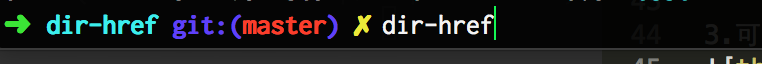
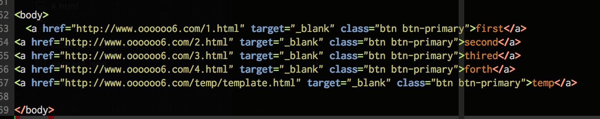

dir-href
##说明
能够找到当前目录下所有的.html文件，并且提示你命名同时生成html目录

##注意
默认忽略以下目录
```
  '.DS_Store',
  '.git',
  'node_modules',
  'bower_compontents',
  'lib',
  'test'
```

**命名时，直接回车将忽略该文件

##安装

```
npm install dir-href -g
```

##使用
```
cd dir/* some dir */

dir-href

```

##Demo示例

1.cd 到相应目录 && dir-href 启动



2.结束后将看到 catalogue.html


3.可以查看catalogue.html ，就可以看到最终目的。



